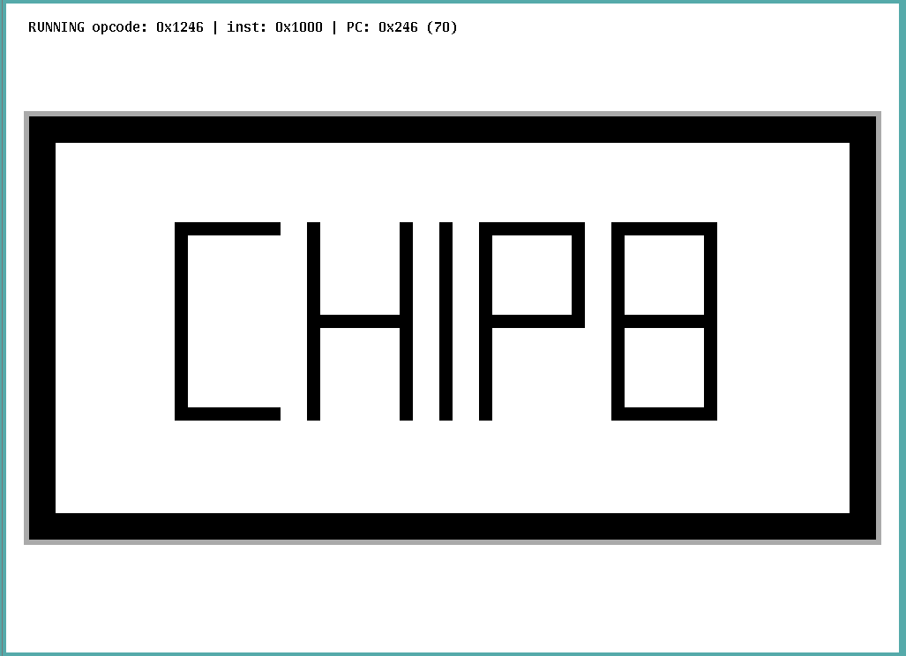

# chip9

CHIP-8 emulator for 9front / plan 9

**Note: this project is a work in progress, I have tested it with a
few ROMs but I cannot garuantee it will work with everything out
there.**

## Keyboard shortcuts

	1	2	3	4
	Q	W	E	R
	A	S	D	F
	Z	x	C	V

To pause the emulator press `p`.

To step the emulator, one instruction at a time press `o`.

To show debugging information press `i`.

## Installation

	mk install
	chip9 ibm.ch8

## License

MIT